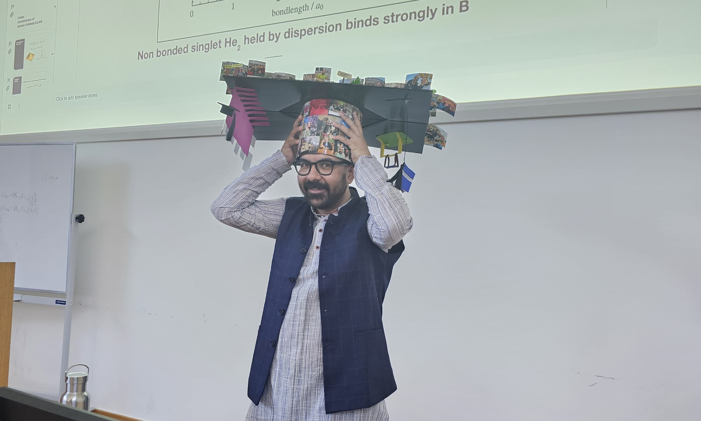

{fig-align="center" width="75%"}

The abbreviation Ph.D. stands for a *Philosophiæ Doctorate*, which in classical Latin is D.Phil (Doctor Philosophiae). The phrase is actually composed of two words that are rooted in the ancient Greek language and the third one is in Latin - "Philo", "Sophia" and "Doctor". The word **Doctor** is associated with a physician in modern times, but it actually means **one who is able to teach**. On the other hand, the word **Philo** means **love** and **Sophia** means **wisdom**. So in totality, the complete meaning of gaining a PhD is about getting trained for

> **teaching others how to nourish love for wisdom**.

I pursued chemistry bachelor's and master's studies at Jadavpur University (JU), India. JU was a place of free and open discussions on any topic and it never mattered how sensitive or abstract the topic was. I was lucky to be a part of it. I learned a lot from there. In the context of the chemistry subject, the only things that I studied with full concentration and interest were the ones which grabbed my attention. I never paid any interest or gave time to those which I did not enjoy. The resulting grades being very bad was inevitable with the habit I had during university. But that did not stop me from applying for a Deutscher Akademischer Austauschdienst (DAAD) scholarship to carry out a PhD in computational chemistry.

The problem with the physical chemistry section in JU was that it was not so equipped with the pedagogy required for modern-day research compared to the organic and inorganic sections. This resulted in a very scarce understanding of how I would carry out my research at the onset of my PhD. On top of that, my supervisor believed maybe too much in my capabilities and left me totally independent. This created a problem of an unclear plan of action for the project and my own research training. Now I started asking myself two questions about how I would become a scientist.

1. Should I just follow the orders of my supervisor?
2. Should I think about my own research question?

The second question raised even more questions such as - how can I create a research question? How do I know its validity and relevance? These are tough questions and I still have no good answers to them. So, I did what seemed to be the most straightforward way - explore. I started exploring different things ranging from programming to new theories of everything in physics to even science philosophy. The more I tried to understand these diverse things, the more divergent I felt. At some point when these things were too much (_in my second year of the PhD_), I felt completely at a loss. Then I started getting back to my main research topic. I always thought that with the basic knowledge I acquired, I could nail down my PhD project. And it turned out to be true for many scientist colleagues of my generation. So, I just obeyed orders and suggestions from my supervisor and successfully published my first paper. I was happy that the project was finished, but I was discontent as well.

But my discontent would not write my thesis, which I needed to have if I wanted to obtain my degree. So I started writing my thesis, and while writing I eventually got bored and started reading different books again (_like I finished Solaris by Stanislaw Lem_). At that moment, there was a sudden realization that I was somehow stuck in a loop of what I already knew in science and I am going to be there forever if I do not go beyond what I know. And then I felt the real meaning of a PhD. It is not about finishing a project. It was neither about travelling to conferences nor meeting new scientists and networking and all these things. It was for me to know myself and have an opinion - scientific or personal or of any kind. The tools that I harnessed during my PhD are not only reading and writing but also observing myself from a third perspective. And then I realised that I needed to find my own research question rather than following someone's advice. I mean surely following advices from senior researchers pay well for writing plenty of research articles and increase career metrics. But what it does is puts you in the bracket of their research and kills the whole point of scientific exploration.  

Therefore, I think that if given a chance, I will do a PhD again because it brought me much closer to myself than anything else in my life. On the 26th of April 2026, I successfully defended my PhD thesis with my parents, brother and partner being present. It will be a very memorable event in my life. 