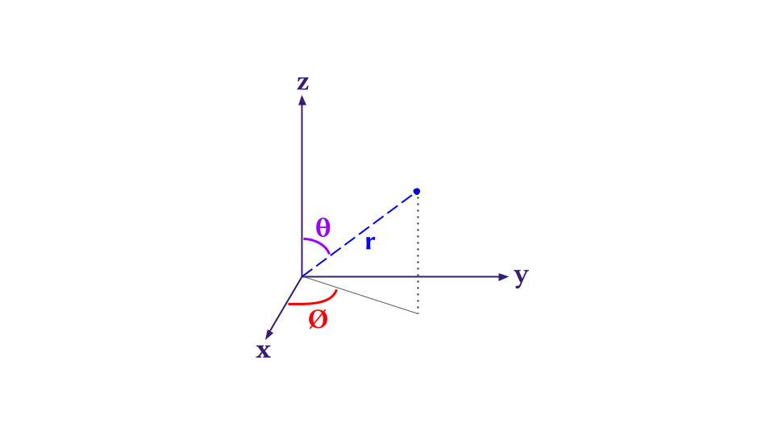

## Polar or Spherical Coordinate System

The spherical or polar coordinate system takes into account one radial component and two angular component to span the space. They are

$$
\begin{align}
&r~\rightarrow~\text{radial component} \\
&\theta~\rightarrow~\text{polar angle}~&[0 \leq \theta \leq \pi] \\
&\phi~\rightarrow~\text{azimuthal angle}~&[0 \leq \phi \leq 2\pi]
\end{align}
$$

It can be illustrated which of the parameter does what in the following diagram.

{fig-align="center" width="60%"}

The relation between the Polar and Cartesian coordinates $\{x,y,z\}$ is

$$
\begin{align}
&x=r \sin\theta \cos\phi \\
&y=r \sin\theta \sin\phi \\
&z=r \cos\theta
\end{align}
$$

and $r = \sqrt{x^2 + y^2 + z^2}$ . In quantum mechanics the major operator which is of interest to us is the Hamiltonian which comprises of Laplacian or double derivative operator.

## How can we transform a Cartesian Laplacian to Spherical?

We need to use multivariable chain rule. The formula for the $x$ component is

$$
\frac{\partial}{\partial x} = \frac{\partial r}{\partial x} \frac{\partial}{\partial r} + \frac{\partial \theta}{\partial x} \frac{\partial}{\partial \theta} + \frac{\partial \phi}{\partial x} \frac{\partial}{\partial \phi}
$$

It is similar for $y$ and $z$. Just replace the $x$ with $y$ or $z$ and the equation would be in front of you.

### Obtaining $\{\frac{\partial r}{\partial x}, \frac{\partial r}{\partial y},\frac{\partial r}{\partial z}\}$

Using $r = \sqrt{x^2 + y^2 + z^2}~ \text{or,} ~r^2 = x^2 + y^2 + z^2$

$$
\frac{\partial r}{\partial x} = \frac{x}{r} \quad\text{and}\quad \frac{\partial r}{\partial y} = \frac{y}{r} \quad\text{and}\quad \frac{\partial r}{\partial z} = \frac{z}{r}
$$

Substituting the values of $\{x,y,z\}$ in polar form we will easily obtain

$$
\begin{align}
&\frac{\partial r}{\partial x} = \sin\theta \cos\phi \\
&\frac{\partial r}{\partial y} = \sin\theta \sin\phi \\
&\frac{\partial r}{\partial z} = \cos\theta
\end{align}
$$

### Obtaining $\{\frac{\partial \theta}{\partial x}, \frac{\partial \theta}{\partial y},\frac{\partial \theta}{\partial z}\}$

The expression with only $\theta$ is

$$
z = r \cos\theta \Rightarrow \cos\theta = \frac{z}{r} 
$$

from this we need to derive the partial derivatives of $\theta$ wrt cartesian variables, so differentiating the above equation wrt $x$ gives

$$
\begin{align}
-\sin\theta \frac{\partial \theta}{\partial x} &= -\frac{z}{r^2} \frac{\partial r}{\partial x}\\
\Rightarrow \frac{\partial \theta}{\partial x} &= \frac{r \cos\theta}{r^2 \sin\theta} \sin\theta \cos\phi \\
\Rightarrow \frac{\partial \theta}{\partial x} &= \frac{\cos\theta \cos\phi}{r}
\end{align}
$$

In a similar case

$$
\begin{align}
&\frac{\partial \theta}{\partial y} = \frac{\cos\theta \sin\phi}{r} \\
&\frac{\partial \theta}{\partial z} = -\frac{\sin\theta}{r}
\end{align}
$$

### Obtaining $\{\frac{\partial \phi}{\partial x}, \frac{\partial \phi}{\partial y},\frac{\partial \phi}{\partial z}\}$

The expression for $\phi$ exclusively can be found in dividing $y/x$

$$
\frac{y}{x} = \frac{r \sin\theta \sin\phi}{r \sin\theta \cos\phi} \Rightarrow \tan\phi = \frac{y}{x}
$$

Differentiating the above expression wrt $x$ gives

$$
\begin{align}
-\frac{y}{x^2} &= \sec^2 \phi ~\frac{\partial \phi}{\partial x} \\
\Rightarrow \frac{\partial \phi}{\partial x} &= -\frac{y \cos^2 \phi}{x^2} \\
\Rightarrow \frac{\partial \phi}{\partial x} &= -\frac{r \sin\theta \sin\phi \cos^2 \phi}{r^2 \sin^2 \theta \cos^2 \phi} \\
\therefore \frac{\partial \phi}{\partial x} &= -\frac{\sin\phi}{r \sin\theta}
\end{align}
$$

Similarly

$$
\begin{align}
&\frac{\partial \phi}{\partial y} = \frac{\cos\phi}{r\sin\theta} \\
&\frac{\partial \phi}{\partial z} = 0 
\end{align}
$$

### Combine and Make $\frac{\partial }{\partial x}$

$$
\begin{align}
\frac{\partial}{\partial x} &= \frac{\partial r}{\partial x} \frac{\partial}{\partial r} + \frac{\partial \theta}{\partial x} \frac{\partial}{\partial \theta} + \frac{\partial \phi}{\partial x} \frac{\partial}{\partial \phi} \\
\frac{\partial}{\partial x} &= \sin\theta \cos\phi \frac{\partial}{\partial r} + \frac{\cos\theta\cos\phi}{r} \frac{\partial}{\partial \theta} - \frac{\sin\phi}{r\sin\theta} \frac{\partial}{\partial \phi}
\end{align}
$$

After similar treatment in the $y$ and $z$ we can easily deduce the first order derivatives

$$
\begin{align}
\frac{\partial}{\partial y} &= \sin\theta\sin\phi\frac{\partial}{\partial r} + \frac{\cos\theta\sin\phi}{r}\frac{\partial}{\partial \theta} + \frac{\cos\phi}{r\sin\theta}\frac{\partial}{\partial \phi}\\
\end{align}
$$

and lastly for $z$

$$
\begin{align}
\frac{\partial}{\partial z} &= \cos\theta \frac{\partial}{\partial r} -\frac{\sin\theta}{r} \frac{\partial}{\partial \theta}\\
\end{align}
$$

From here on the $\frac{\partial^2}{\partial x^2}$ is much messier because we need to differentiate a differentiated function. Principally, one can do it on pen and paper, but we rather use either `wolfram mathematica` or `sympy` from **python**, whatever is available to compute symbolic algebra. 


::: {.callout-important}

It is to be noted that `Wolfram` has been built over decades so it has the richest symbolic algebra system in the world right now. But the only issue is its closedness. Hence, the reachability to many students, I believe, would be low. Hence for those I give the python `sympy` alternative. I also tried `Julia`'s `Symbolics.jl` package but it was not so easy for me. In future when I get used to it I will also provide `Julia` tutorial too for this. For now we stick with `Wolfram` and `Python`

:::


## Wolfram

If one has `Wolfram Mathematica` license or open source license then it is much easier to look at Laplacian directly in different coordinate system.

``` mathematica
Laplacian[f[r, theta, phi], {r, theta, phi}, "Spherical"] //Simplify //Expand
```

The result would be obtained directly and there would be terms like $f^{(2,0,0)} [r,\text{theta}, \text{phi}]$ which is equivalent to $\frac{\partial^2 f}{\partial r^2}$

## Python

In `sympy` one has to do a little bit coding to derive it, first importing the package

::: {.callout-note title="Displaying Formula and Equations"}
Use Jupyter notebook environment for the latex equation rendering and the function `display(expr)` automatically renders a latex expression in the notebook output cell. If one wants to have raw latex syntax for the expression one should use `latex(expr)` for it. I have not tried marimo notebooks for this stuff, but I hope it would work the same.
:::

``` python
from sympy import * 
```


::: {.callout-tip}

If one wants to import like the following

```python
import sympy as sp
```

then all the functions need to be called like 

```python
d_expr = sp.diff(expr)
```
:::


Defining variables and functions

``` python
r, theta, phi = symbols('r theta phi', positive=True, real=True)
f = Function('f')(r, theta, phi)
```

Defining a python function to differentiate, although one can do it manually hard-coding by using `diff()` sympy function.

``` python
def diff_xi(cf_r, cf_theta, cf_phi, expr):
    return cf_r * diff(expr, r) + cf_theta * diff(expr, theta) + cf_phi * diff(expr, phi)
```

The `cf_r` and others are coefficients of the derivative expression (*which are derived earlier by hand*). So one needs to put them into variables

``` python
# x coeffs
ax_r = sin(theta) * cos(phi)
ax_theta = cos(theta) * cos(phi) / r
ax_phi = -sin(phi) / (r * sin(theta))
# y coeffs
ay_r = sin(theta) * sin(phi)
ay_theta = cos(theta) * sin(phi) / r
ay_phi = cos(phi) / (r * sin(theta))
# z coeffs
az_r = cos(theta)
az_theta = -sin(theta) / r
az_phi = 0
```

Do the double derivative using the custom `diff_xi()` function.

``` python
d2f_dx2 = diff_xi(ax_r, ax_theta, ax_phi, diff_xi(ax_r, ax_theta, ax_phi, f))
d2f_dy2 = diff_xi(ay_r, ay_theta, ay_phi, diff_xi(ay_r, ay_theta, ay_phi, f))
d2f_dz2 = diff_xi(az_r, az_theta, az_phi, diff_xi(az_r, az_theta, az_phi, f))
```

Calculate the Laplacian by summing them all up.

``` python
laplacian = d2f_dx2 + d2f_dy2 + d2f_dz2
```

Now display the Laplacian

``` python
display(expand(simplify(laplacian)))
```

The output is

$$
\frac{\partial^{2}}{\partial r^{2}} f{\left(r,\theta,\phi \right)} + \frac{2 \frac{\partial}{\partial r} f{\left(r,\theta,\phi \right)}}{r} + \frac{\frac{\partial^{2}}{\partial \theta^{2}} f{\left(r,\theta,\phi \right)}}{r^{2}} + \frac{\frac{\partial}{\partial \theta} f{\left(r,\theta,\phi \right)}}{r^{2} \tan{\left(\theta \right)}} + \frac{\frac{\partial^{2}}{\partial \phi^{2}} f{\left(r,\theta,\phi \right)}}{r^{2} \sin^{2}{\left(\theta \right)}}
$$

which can be simplified further to be written as

$$
\frac{\partial^{2}}{\partial r^{2}} + \frac{2}{r} \frac{\partial}{\partial r} + \frac{1}{r^{2}} \frac{\partial^{2}}{\partial \theta^{2}} + \frac{\cot\theta}{r^2}\frac{\partial}{\partial \theta} + \frac{1}{r^2  \sin^2\theta}\frac{\partial^2}{\partial \phi^2}
$$

The equation can be also written in a way which textbooks write it.

$$
\nabla^2 = \frac{1}{r^2}\frac{\partial}{\partial r} \left(r^2 \frac{\partial}{\partial r} \right) + \frac{1}{r^2 \sin\theta} \frac{\partial }{\partial \theta} \left(\sin \theta \frac{\partial}{\partial \theta}\right) + \frac{1}{r^2 \sin^2\theta} \frac{\partial^2}{\partial \phi^2} 
$$

# Cylindrical Coordinate System

Similar to polar coordinate system, cylindrical coordinate system can be visualized as follows where the degree of freedom is $\{\rho, \phi,z\}$.

](cylindrical-illust.svg){fig-align="center" width="40%"}

One can go through hardships again using pen and paper and derive the Laplacian in cylindrical coordinate system exactly like in the previous case. Or if you are lazy like me use `wolfram` or use a hybrid method with `sympy`. Here I use `wolfram`. Firstly, the relation between the Cartesian and Cylindrical can also be seen using the following command

``` mathematica
CoordinateTransform["Cylindrical" -> "Cartesian", {rho, phi, z}]
```

The relations are

$$
\begin{align}
    &x = \rho \cos \phi \\
    &y = \rho \sin \phi \\
    &z=z
\end{align}
$$

where

$$
\rho=\sqrt{ x^2 + y^2 }
$$

Just like the previous treatment, one can use the same chain rule logic and find the Laplacian or

``` mathematica
Laplacian[f[rho, phi, z], {rho, phi, z}, "Cylindrical"] //Simplify //Expand
```

and the result is

$$
\nabla^2=\frac{\partial^2}{\partial z^2} + \frac{1}{\rho^2}\frac{\partial^2}{\partial \phi^2} + \frac{1}{\rho}\frac{\partial}{\partial \rho} + \frac{\partial^2}{\partial \rho^2}
$$

